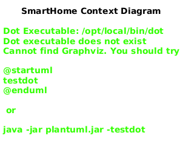
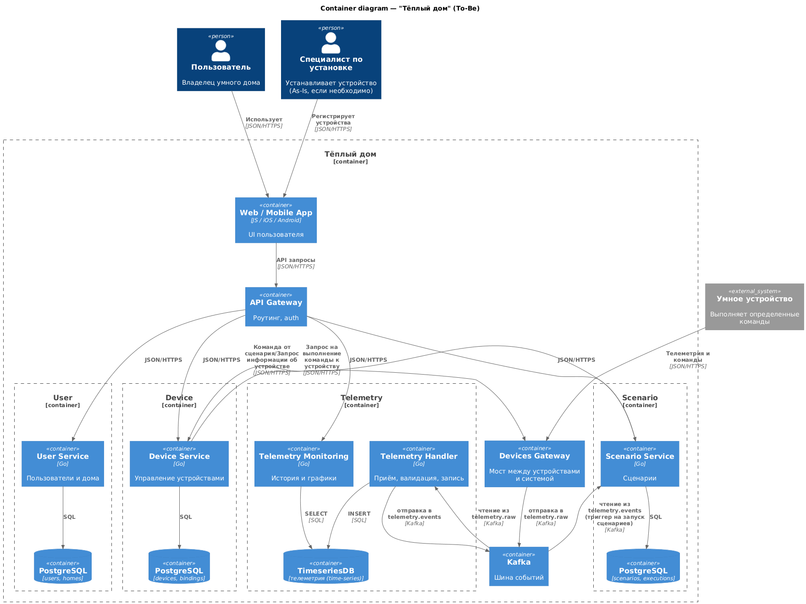
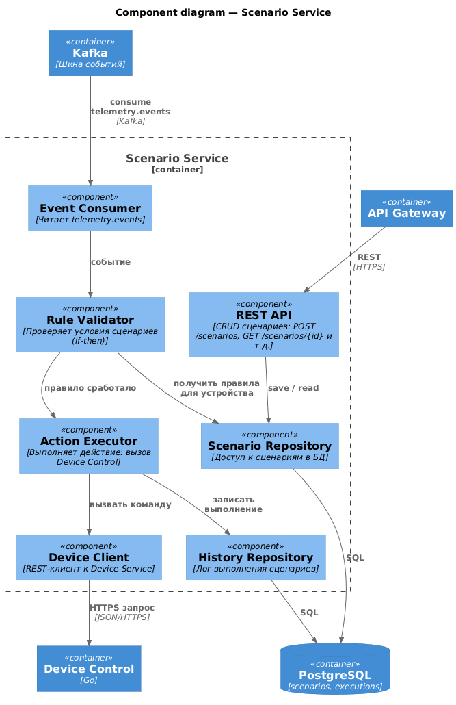
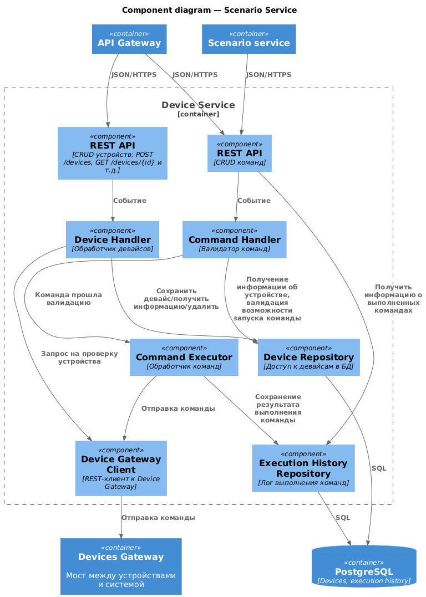
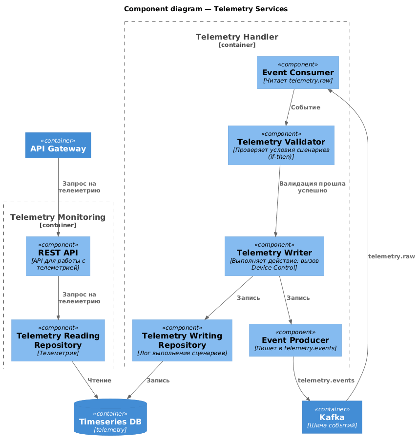
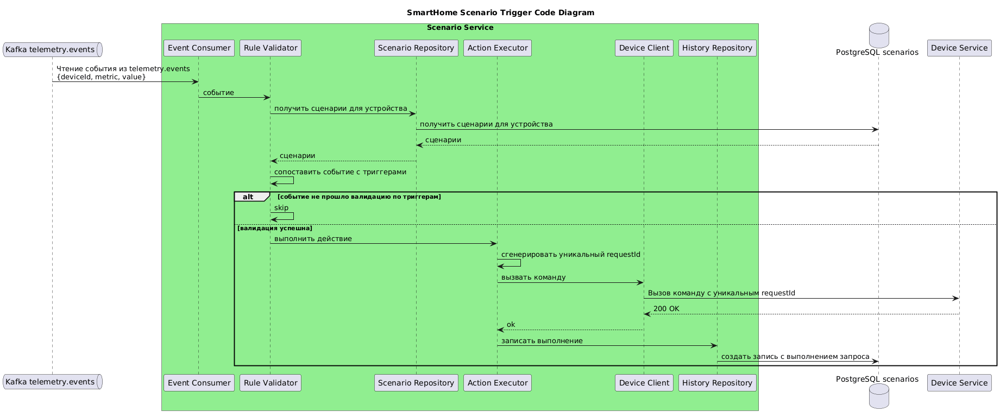
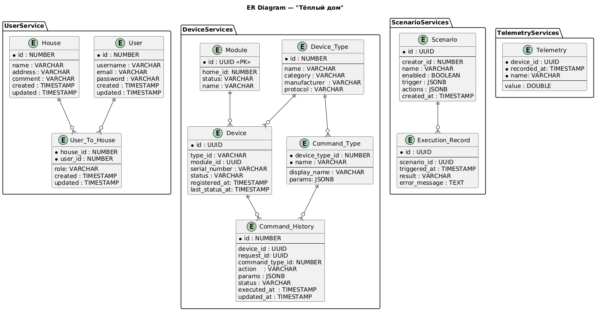

# Project_template

Это шаблон для решения проектной работы. Структура этого файла повторяет структуру заданий. Заполняйте его по мере работы над решением.

# Задание 1. Анализ и планирование

<aside>

Чтобы составить документ с описанием текущей архитектуры приложения, можно часть информации взять из описания компании и условия задания. Это нормально.

</aside>

### 1. Описание функциональности монолитного приложения

**Управление отоплением:**

Пользователи могут удалённо включать/выключать отопление в своих домах.

**Мониторинг температуры:**

- Пользователи могут просматривать текущую температуру в своих домах через веб-интерфейс.
- Система получает данные о температуре с датчиков, установленных в домах.

### 2. Анализ архитектуры монолитного приложения

Язык программирования: Go
База данных: PostgreSQL
Архитектура: Монолитная, все компоненты системы (обработка запросов, бизнес-логика, работа с данными) находятся в рамках одного приложения.
Взаимодействие: Синхронное, запросы обрабатываются последовательно.
Масштабируемость: Ограничена, так как монолит сложно масштабировать по частям.
Развертывание: Требует остановки всего приложения.

### 3. Определение доменов и границы контекстов

- домен Управление отоплением
- домен Мониторинг температуры
  - поддомен получения информации о температуре
- домен Управление устройствами
  - поддомен Установка и настройка устройства
    - контекст Установка устройства специалистом
  - поддомен Учет устройств
    - контекст Регистрация устройства в системе
- домен Пользователи и дома

### **4. Проблемы монолитного решения**

- Нагрузка на разные части системы распределяется неравномерно. Например, сервис мониторинга температуры может использоваться намного чаще, чем управление отоплением, но в монолитной архитектуре нельзя масштабировать только нужную часть системы.
- Все компоненты системы тесно связаны между собой.
  - Из-за этого изменение или доработка одной части приложения может требовать изменений в других модулях, что усложняет развитие и поддержку системы. К тому же растет вероятность возникновения ошибок.
  - Компания планирует дать пользователям возможность самостоятельно подключать устройства. Однако, если монолитное приложение станет недоступным из-за ошибки в другом компоненте, пользователи не смогут подключить оборудование, что может привести к росту числа обращений в поддержку и возвратов.

  ### 5. Визуализация контекста системы — диаграмма С4



# Задание 2. Проектирование микросервисной архитектуры

Я ориентировался на новые домены, исходя из целей компании.
- домен Устройства
  - поддомен Команды
    - контекст отправка команд на выполнение
  - поддомен Учет устройств
    - контекст регистрация устройства в системе
  - поддомен Подключение
    - контекст установка специалистом (As-Is)
    - контекст самостоятаельно подключение (To-Be)
- Домен Программирования системы
  - поддомен Управление сценариями
    - контекст движок сценариев (создание, редактирование)
- домен Мониторинг
  - поддомен Хранение телеметрии
    - контекст Валидация входяших данных, хранение
  - поддомен Мониторинг телеметрии
    - контекст Выдачи истории, построение графиков и т.д.
- домен Пользователи и дома
  - поддомен Пользователи
    - контекст Управление пользователями и домами
    - контекст Управление доступами

Диаграмма контейнера

Диаграмма компонента сценариев

Диаграмма компонента девайсов

Диаграмма компонента телеметрии

Диаграмма кода


# Задание 3. Разработка ER-диаграммы



# Задание 4. Создание и документирование API

### 1. Тип API

Укажите, какой тип API вы будете использовать для взаимодействия микросервисов. Объясните своё решение.

Будет задействовано как синхронное, так и асинхронное взаимодействие.
- Телеметрия будет отдавать события по метрикам устройств в отдельный топик, откуда может читать любой нуждающийся консьюмер (в данный момент это сервис Сценариев). Выбор обусловлен несколькими факторами :
  - Потом метрик может быть достаточно большим, что вероятно приведет к невозможности синхронного взаимодействия.
  - С точки зрения Сервиса Телеметрии абсолютно неважно, кто является потребителем событий с устройств. Помимо этого, в будущем количество сервисов, которым важна информация по метрикам может увеличиться, асинхронное взаимодействие через топики позволит вводить эти сервисы с минимумо доработок.

- Между сервисами Сценариев и Устройств - синхронное взаимодействие, поскольку по результату команд нужен немедленный ответ.

### 2. Документация API

#### REST API

- **Device Service:** [SmartHome_Device_API.yaml](diagrams/context/api/SmartHome_Device_API.yaml)
- **Scenario Service:** [SmartHome_Scenario_API.yaml](diagrams/context/api/SmartHome_Scenario_API.yaml)
- **Telemetry Service:** [SmartHome_Telemetry_API.yaml](diagrams/context/api/SmartHome_Telemetry_API.yaml)

#### Async API

- **Telemetry Events:** [SmartHome_Telemetry_Async_API.yaml](diagrams/context/api/SmartHome_Telemetry_Async_API.yaml)

# Задание 5. Работа с docker и docker-compose

Перейдите в apps.

Там находится приложение-монолит для работы с датчиками температуры. В README.md описано как запустить решение.

Вам нужно:

1) сделать простое приложение temperature-api на любом удобном для вас языке программирования, которое при запросе /temperature?location= будет отдавать рандомное значение температуры.

Locations - название комнаты, sensorId - идентификатор названия комнаты

```
	// If no location is provided, use a default based on sensor ID
	if location == "" {
		switch sensorID {
		case "1":
			location = "Living Room"
		case "2":
			location = "Bedroom"
		case "3":
			location = "Kitchen"
		default:
			location = "Unknown"
		}
	}

	// If no sensor ID is provided, generate one based on location
	if sensorID == "" {
		switch location {
		case "Living Room":
			sensorID = "1"
		case "Bedroom":
			sensorID = "2"
		case "Kitchen":
			sensorID = "3"
		default:
			sensorID = "0"
		}
	}
```

2) Приложение следует упаковать в Docker и добавить в docker-compose. Порт по умолчанию должен быть 8081
3) Кроме того для smart_home приложения требуется база данных - добавьте в docker-compose файл настройки для запуска postgres с указанием скрипта инициализации ./smart_home/init.sql

Для проверки можно использовать Postman коллекцию smarthome-api.postman_collection.json и вызвать:

- Create Sensor
- Get All Sensors

Должно при каждом вызове отображаться разное значение температуры

Ревьюер будет проверять точно так же.
